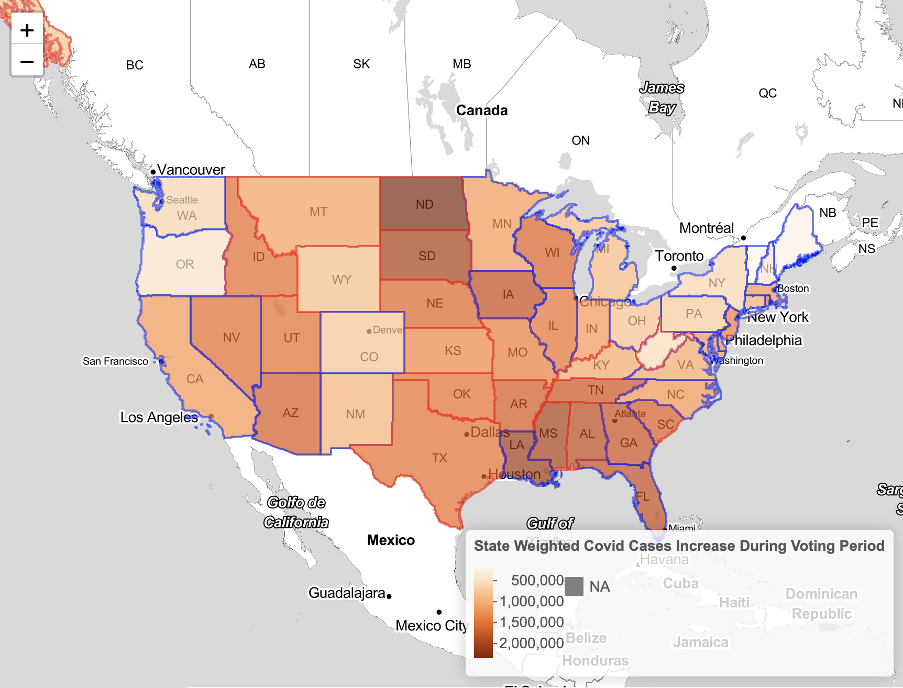

## The Relationship between Governors' tweets and COVID-19 Cases by State
We want to explore the sentiment of governors' tweets about COVID-19 and Election in 2020. We also comapared the sentiment score and COVID-19 cases by state to see whether there's correlation between them.


```{r setup, echo=TRUE, eval=TRUE, message=FALSE, warning=FALSE}
knitr::opts_chunk$set(echo=TRUE,eval=TRUE, message=FALSE, warning=FALSE)
```

```{r}
library(httr)
set_config(use_proxy(url="127.0.0.1",port=15236))
```


```{r}
library(tidyverse)
library(lubridate)
library(rtweet)
library(leaflet)
library(tigris)
library(plotly)
library(readxl)
library(ggthemes)
library(leaflet)
library(wordcloud)

```


```{r}
governor_tweets <- readRDS("governor_tweets.RDS")
governor <- read_csv("governors_twitter1.csv")%>%
 select(state, governor, party, twitter_handle, state_abbr)
```

```{r}
d <- filter(governor_tweets, grepl("COVID19|corona|virus|SocialDistancing|distancing|mask|ballot|elect|vote", text))
tweets <- d %>%
        filter(is_retweet==FALSE) %>%
        select(text,screen_name,hashtags,retweet_count)%>%
        left_join(governor, by=c("screen_name"="twitter_handle"))
```

## PART 1: Sentiment of Governors' Tweets about COVID and Election

In the first part, we cleaned governors' tweets and did a bunch of visualizations to get an overview of the tweets.
```{r}
#### word cloud and sentiment
library(tm)
corpus0 <-VCorpus(VectorSource(tweets$text))
# remove fully capitalized words 
corpus1 = tm_map(corpus0, content_transformer(function(x) gsub("\\b[A-Z]+\\b","",x))) 
corpus1 = tm_map(corpus0, content_transformer(function(x) gsub("[^[:alnum:][:space:]]","",x))) 
# create a function to space and remove URLs
removeURL <- content_transformer(function(x) gsub("(f|ht)tp(s?)://\\S+", "", x, perl=T))
corpus1 = tm_map(corpus1, removeURL)
# clean text
clean_corpus <- function(corpus){
  corpus <- tm_map(corpus, removePunctuation)
  # corpus <- tm_map(corpus, content_transformer(removeNumPunct)) # from qdap
  corpus <- tm_map(corpus, content_transformer(tolower))
  #corpus <- tm_map(corpus, content_transformer(replace_symbol)) # from qdap
  corpus <- tm_map(corpus, removeWords, c(stopwords("en")))
    # We could add more stop words as above
  corpus <- tm_map(corpus, removeNumbers)
  corpus <- tm_map(corpus, stripWhitespace)
  return(corpus)
}

clean_corpus<-clean_corpus(corpus1)
  

library("SnowballC")
corpus1_dtm <- DocumentTermMatrix(clean_corpus)
corpus1_dtm <- as.matrix(corpus1_dtm)
```

```{r}
adt = as.data.frame(corpus1_dtm)
all = colSums(adt)
all = data.frame('all'=all)
all$labels = rownames(all)
all = all[order(all[,1],decreasing = TRUE),]
top20all = all[1:20,]
top20all$labels = factor(top20all$labels, levels = top20all$labels)
```

### Plot Most Frequent 20 Words
```{r,fig.width=10}
g_top20 <- ggplot(top20all,aes(x = labels, y = all)) + 
  geom_bar(stat = 'identity',fill="coral")+ylim(c(0,4000))+
  coord_flip() +
  labs(title="Top 20 Words in US Governors' Covid 19 and Election Related Tweets",
    x='Words',y = 'Frequency',caption= "Source:Twitter"
    )+theme_pander()+
  theme(plot.title = element_text(size = 16, face = "bold", hjust = 0.5), 
        axis.text.x = element_text(size=12, hjust=0.1,vjust=1), 
        axis.text.y = element_text(size=10, face="bold"), 
        axis.title.y = element_text(size=10,face="bold"),
        axis.title.x = element_blank(),
        plot.caption = element_text(size=11, face="bold"),
        panel.grid.major.x = element_blank())
g_top20 
```
From the barplot above, we can see the top 20 words in governors' tweets. We can see that words like Covid, mask, vaccine and virus get the most frequencies. We can also see that words like test, vote, work and spread are pretty frequent as well.

### Plot positive & negative word clouds by party
```{r}
pos <- read.table("positive-words.txt", as.is=T)
neg <- read.table("negative-words.txt", as.is=T)
vector = c()
sentiment <- function(words){
  require(quanteda)
  tok <- quanteda::tokens(words)
  pos.count <- sum(tok[[1]]%in%pos[,1])
  #cat("\n positive words:",tok[[1]][which(tok[[1]]%in%pos[,1])],"\n")
  neg.count <- sum(tok[[1]]%in%neg[,1])
  #cat("\n negative words:",tok[[1]][which(tok[[1]]%in%neg[,1])],"\n")
  out <- (pos.count - neg.count)/(pos.count+neg.count)
  #cat("\n Tone of Document:",out)
  out
}
for (i in 1:7267){
  vector[i] <- sentiment(tweets$text[i])
}
tweets["Tone_of_Text"] = vector


```

```{r}
#plot positive vs negative words by party
#split tweets by party
d_tweets <- tweets%>%
    filter(grepl( "D", party))

r_tweets <- tweets%>%
    filter(grepl( "R", party))
  
```

### Plot Democratic Positive & Negative Words
```{r,message=FALSE,warning=FALSE,fig.height=10}
# filter positive texts and negative texts
d_pos_texts <- d_tweets %>%
  filter(Tone_of_Text > 0) %>%
  select(text)
d_neg_texts <- d_tweets %>%
  filter(Tone_of_Text < 0) %>%
  select(text)
com_texts <- c(d_pos_texts,d_neg_texts)
com_corpus <-VCorpus(VectorSource(com_texts))
com_corpus = tm_map(com_corpus, content_transformer(function(x) gsub("\\b[A-Z]+\\b","",x))) 
com_corpus = tm_map(com_corpus, content_transformer(function(x) gsub("[^[:alnum:][:space:]]","",x))) 
com_corpus = tm_map(com_corpus, content_transformer(tolower))  
com_corpus = tm_map(com_corpus, removeNumbers)
com_corpus = tm_map(com_corpus, removePunctuation)
com_corpus = tm_map(com_corpus, removeWords, c(stopwords("en")))
com_corpus = tm_map(com_corpus, stripWhitespace)
#create document-term-matrix 
com_dtm <- DocumentTermMatrix(com_corpus)
com_dtm_ma <- as.matrix(com_dtm)
com_tdm <- TermDocumentMatrix(com_corpus)
com_ma <- as.matrix(com_tdm)
colnames(com_ma) <- c("positive words","negative words")
comparison.cloud(com_ma, colors = c("steelblue","lightsteelblue2"), title.size= 2,
                 scale = c(6,2), max.words = 100, shape = "circle")
```


From the comparison wordcloud above, we can see the negative word cloud is dominated by words like virus, spread, cases, lost, etc. And positive word cloud's got words like protect, mask, test, vaccine, etc.

### Plot Republican Positive & Negative Words
```{r,message=FALSE,warning=FALSE,fig.height=10}
# filter positive texts and negative texts
r_pos_texts <- r_tweets %>%
  filter(Tone_of_Text > 0) %>%
  select(text)
r_neg_texts <- r_tweets %>%
  filter(Tone_of_Text < 0) %>%
  select(text)
com_texts <- c(r_pos_texts,r_neg_texts)
com_corpus <-VCorpus(VectorSource(com_texts))
com_corpus = tm_map(com_corpus, content_transformer(function(x) gsub("\\b[A-Z]+\\b","",x)))
com_corpus = tm_map(com_corpus, content_transformer(function(x) gsub("[^[:alnum:][:space:]]","",x))) 
com_corpus = tm_map(com_corpus, content_transformer(tolower))  
com_corpus = tm_map(com_corpus, removeNumbers)
com_corpus = tm_map(com_corpus, removePunctuation)
com_corpus = tm_map(com_corpus, removeWords, c(stopwords("en")))
com_corpus = tm_map(com_corpus, stripWhitespace)
#create document-term-matrix 
com_dtm <- DocumentTermMatrix(com_corpus)
com_dtm_ma <- as.matrix(com_dtm)
com_tdm <- TermDocumentMatrix(com_corpus)
com_ma <- as.matrix(com_tdm)
colnames(com_ma) <- c("positive words","negative words")
comparison.cloud(com_ma, colors = c("coral","lightpink"), title.size= 2,
                 scale = c(6,2), max.words = 100, shape = "circle")
```


The Republican comparison word cloud is pretty much the same as Democratic word cloud, which is dominated by words like virus, outbreak, etc. 

## PART 2: Average Sentiment Scores of Governors' Tweets and COVID Cases
Relationship between Average Sentiment Score of Governors' tweets about COVID19 and Confirmed COVID Cases by State
```{r,include=FALSE}
#preprocessiong and creating geo object
geoid<-read.csv("state_fips_master.csv")
geoid<-rename(geoid, c("state.abb"="state_abbr"))
geoid<-rename(geoid, c("GEOID"="fips"))
geoid<-geoid %>%
  select(state.abb, GEOID)
#Convert GEOID into characters
geoid$GEOID<-as.character(geoid$GEOID)
#Certain fip-codes need to be pre-processed
geoid$GEOID[geoid$state.abb=="AL"]<-"01"
geoid$GEOID[geoid$state.abb=="AK"]<-"02"
geoid$GEOID[geoid$state.abb=="AZ"]<-"04"
geoid$GEOID[geoid$state.abb=="AR"]<-"05"
geoid$GEOID[geoid$state.abb=="CA"]<-"06"
geoid$GEOID[geoid$state.abb=="CO"]<-"08"
geoid$GEOID[geoid$state.abb=="CT"]<-"09"
#Add fip-codes for District of Columbia
DC<-c("DC","11")
geoid<-rbind(geoid,DC)

library(tigris)
options(tigris_use_cache = TRUE)

stateshape<-states(cb=TRUE)

covid_tweets <- filter(tweets, grepl("COVID19|corona|virus|SocialDistancing|distancing|mask", text))
governor_sentiment <- aggregate(covid_tweets[, 9], list(covid_tweets$screen_name), na.rm = TRUE, mean)%>%
        left_join(governor, by=c("Group.1"="twitter_handle"))%>%
        rename(twitter_handle=Group.1)
governor_sentiment <- governor_sentiment %>%
        rename(avg_senti=Tone_of_Text)
total_covid <- read_excel("total_covid.xlsx")
alldata <- left_join(governor_sentiment, geoid, by=c("state_abbr"="state.abb"))
#appending covid case data
alldata <- left_join(alldata, total_covid, by="GEOID")
allbystate=geo_join(stateshape, alldata, "STATEFP", "GEOID")
```

### Plot Average Sentiment Score of each Governor by State
```{r,fig.height=10,fig.width=10}
#putting average sentiment to leaflet map
content<-paste("State:", allbystate$state, "<br/>",
              "Avg sentiment score of governor tweets about COVID:", allbystate$avg_senti, "<br/>",                "Total number of cases:", allbystate$total_cases, "<br/>",
              "Governor party:", allbystate$party, "<br/>")
pal=colorNumeric(palette="Oranges", allbystate$avg_senti) 
leafletmap2<-leaflet() %>%
  addTiles() %>%
  addProviderTiles("Stamen.TonerLite") %>%
  setView(-98.1156, 38.4204, zoom=4) %>%
  addPolygons(data=allbystate, fillColor=~pal(allbystate$avg_senti), color=allbystate$party, fillOpacity=0.7, weight=2, smoothFactor=0.2, popup=content, label=~stringr::str_c(state, ' See pop-up for more info'), labelOptions=labelOptions(direction='auto'), highlightOptions=highlightOptions(color=allbystate$party, weight=5, bringToFront=TRUE, sendToBack=TRUE)) %>%
  addLegend("bottomright", pal=pal, values=allbystate$avg_senti, title="Average sentiment score", opacity=1)
leafletmap2
```
From the leaflet map above, we can see that states like Arizona, Idaho, West Virginia, and Texas have relatively positive sentiment scores. On the other hand, states like New Mexico, South Carolina, Washington and New York have relatively negative sentiment scores.

### Compare the Average Sentiment Leaflet Map Above to Covid Cases Leaflet Map
```{r,fig.height=10,fig.width=10}

```
Comparing the two leaflet maps above, we can't see obvious correlation between sentiment score and Covid cases.
          


